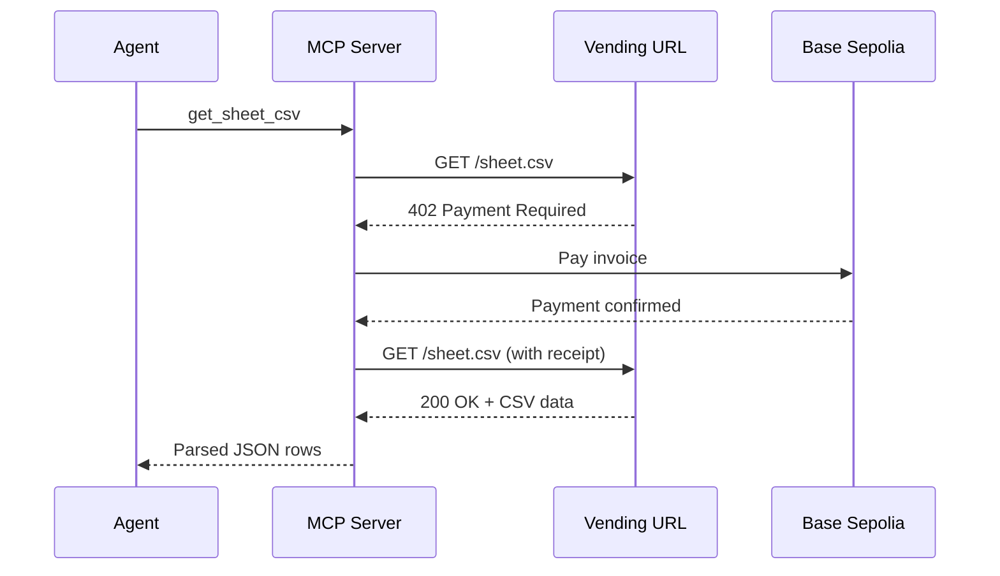

# MCP x402 Railway Server

A Model Context Protocol (MCP) server that enables AI agents to access paywalled Google Sheets (or any x402-protected resources) using automatic micropayments on Base Sepolia.

## Features

- **WebSocket Transport**: Remote MCP server accessible via `wss://`
- **x402 Auto-Payment**: Automatically pays for 402-protected resources using testnet wallet
- **CSV Parsing**: Fetches and parses Google Sheets CSV data
- **Railway-Ready**: Optimized for one-click Railway deployment

## Local Development

### Prerequisites

- Node.js 18+
- Base Sepolia testnet private key with funds ([faucet](https://www.coinbase.com/faucets/base-ethereum-sepolia-faucet))
- A vending URL for your paywalled resource

### Setup

1. **Install dependencies**:
   ```bash
   npm install
   ```

2. **Configure environment**:
   ```bash
   cp .env.example .env
   ```
   Edit `.env` and set:
   - `PRIVATE_KEY`: Your Base Sepolia private key (0x...)
   - `PAID_SHEET_URL`: Your vending URL (e.g., `https://vender.run/@you/sheets/products.csv`)
   - `PORT`: Local port (default: 8080)

3. **Run locally**:
   ```bash
   npm run dev
   ```

4. **Test WebSocket endpoint**:
   ```
   ws://localhost:8080/ws
   ```

## Railway Deployment

### One-Click Deploy

1. **Push to GitHub**:
   ```bash
   git init
   git add .
   git commit -m "Initial commit"
   git remote add origin <your-repo-url>
   git push -u origin main
   ```

2. **Deploy on Railway**:
   - Go to [Railway](https://railway.app)
   - Click **New Project** → **Deploy from GitHub**
   - Select your repository
   - Railway auto-detects Node.js and builds

3. **Set Environment Variables**:
   In Railway dashboard → Variables tab, add:
   ```
   PRIVATE_KEY=0xYOUR_TESTNET_PRIVATE_KEY
   PAID_SHEET_URL=https://vender.run/@you/sheets/products.csv
   ```
   (Railway automatically provides `PORT`)

4. **Get Your WebSocket URL**:
   After deployment, Railway provides a domain like:
   ```
   https://mcp-x402-abc123.up.railway.app
   ```
   Your MCP WebSocket endpoint is:
   ```
   wss://mcp-x402-abc123.up.railway.app/ws
   ```

## Client Configuration

### Claude Desktop

Add to your Claude Desktop MCP settings:

```json
{
  "mcpServers": {
    "x402-sheets": {
      "transport": "websocket",
      "url": "wss://your-railway-app.up.railway.app/ws"
    }
  }
}
```

### Tool Usage

Invoke the `get_sheet_csv` tool:

```json
{
  "tool": "get_sheet_csv",
  "arguments": {
    "maxRows": 50
  }
}
```

**What happens**:
1. Server fetches your `PAID_SHEET_URL`
2. Gets `402 Payment Required` response
3. Automatically pays using configured wallet
4. Retries request and returns CSV data
5. Parses CSV into JSON rows

## How It Works



## Architecture

- **MCP SDK**: Standard Model Context Protocol implementation
- **x402-fetch**: Wrapper that intercepts 402 responses and pays invoices
- **viem**: Ethereum wallet client for Base Sepolia transactions
- **WebSocket**: Required for remote MCP transport (HTTP not supported)

## Security Notes

- **Testnet Only**: This example uses Base Sepolia for safety
- **Key Management**: Store `PRIVATE_KEY` in Railway environment variables only
- **Never Commit Secrets**: `.env` is gitignored
- **Rotate Keys**: Use dedicated testnet wallets for demos

## Troubleshooting

| Issue | Solution |
|-------|----------|
| App won't start | Verify `PRIVATE_KEY` and `PAID_SHEET_URL` are set in Railway |
| Client can't connect | Confirm WebSocket URL uses `/ws` path |
| Payment fails | Check wallet has Base Sepolia ETH + test USDC |
| CSV parsing errors | Ensure vending URL returns valid CSV format |

## Extending

Replace `PAID_SHEET_URL` with any x402-protected resource:
- Notion page proxy
- AI summarization API
- Private database query endpoint
- Custom vended content

No code changes needed—just update the environment variable.

## License

MIT# mcp-googlesheet-vendor
